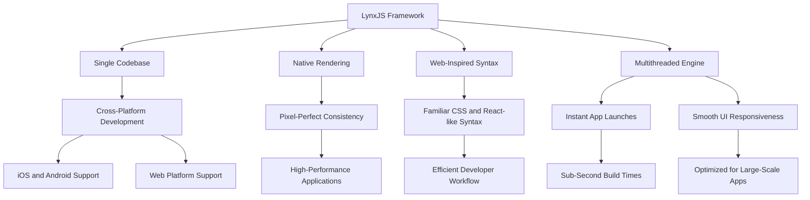

Have you ever wondered how to streamline your development process across multiple platforms? LynxJS, an innovative open-source framework developed by ByteDance, the company behind TikTok, offers a compelling solution. LynxJS empowers developers to create cross-platform applications with native user interfaces (UIs) using a single codebase. By leveraging web technologies like JavaScript, CSS, and React-inspired syntax, LynxJS allows developers to build high-performance applications for mobile (iOS and Android) and web platforms.



### Why is LynxJS Popular?

LynxJS has gained significant traction in the developer community for several reasons. Firstly, it bridges the gap between web and native development, enabling developers to write code once and render it natively across multiple platforms. This capability is particularly appealing to developers who seek to optimize their workflow and reduce the complexity of maintaining separate codebases for different platforms.

Secondly, LynxJS offers a powerful, modern approach to building cross-platform apps. Its custom renderer ensures pixel-perfect consistency and native performance, setting it apart from other cross-platform frameworks that rely heavily on web views. This attention to performance makes LynxJS an attractive option for developers looking to deliver high-quality user experiences.

### Who Uses LynxJS?

LynxJS is designed to cater to a broad audience of developers. Whether you are a web developer looking to dip your toes into native app development or a seasoned mobile developer seeking a unified workflow, LynxJS offers a compelling solution. Its familiar CSS and React-like syntax make it accessible to developers with existing web knowledge, while its scalability and performance features appeal to those working on large-scale projects.

### Comparison Table: LynxJS vs. React Native

| Feature | LynxJS | React Native |
| --- | --- | --- |
| **Performance** | Superior, with a custom renderer and multithreaded engine | Good, but relies on web views for rendering |
| **Developer Experience** | Sub-second build times and familiar syntax | Mature ecosystem with a large community |
| **Scalability** | Optimized for large-scale applications | Suitable for various app sizes |
| **Community Support** | Growing, backed by ByteDance | Established, with extensive resources |
| **Third-Party Libraries** | Limited, but expanding | Extensive, with a wide range of options |
| **Learning Curve** | Accessible for web developers | Steeper for those new to mobile development |

### Is LynxJS Production Ready?

As of now, LynxJS is still in development and may not be suitable for production use. However, its potential is evident, and many developers are eagerly exploring its capabilities. The framework's open-source nature and backing by ByteDance position it for rapid growth and adoption in the developer community. As more developers contribute to its ecosystem and third-party libraries become available, LynxJS is poised to become a robust option for production-ready applications.

### Is LynxJS Better Than React Native?

The comparison between LynxJS and React Native is a hot topic among developers. While both frameworks aim to simplify cross-platform development, LynxJS offers several advantages. Its custom renderer and multithreaded engine provide superior performance compared to React Native's web-view-based approach. Additionally, LynxJS's sub-second build times and familiar syntax contribute to a more efficient developer experience.

However, React Native has a more mature ecosystem and a larger community, which can be beneficial for finding resources and third-party libraries. Ultimately, the choice between LynxJS and React Native will depend on your specific project requirements and preferences.

### Why is LynxJS a Better Option?

LynxJS stands out as a better option for several reasons. Its performance-focused architecture, powered by Rust and a multithreaded engine, ensures instant app launches and smooth UI responsiveness. This makes it ideal for large-scale, interactive applications. Additionally, LynxJS's open-source nature and backing by ByteDance position it for rapid growth and community support.

Moreover, LynxJS's familiar syntax and tooling make it accessible to developers with existing web knowledge, lowering the barrier to entry for cross-platform development. Its scalability and potential for integration with other tools and libraries further enhance its appeal as a modern, efficient framework for building high-performance applications.

### Getting Started with LynxJS

To get started with LynxJS, you'll need to set up your development environment. LynxJS assumes some familiarity with modern JavaScript workflows but provides a streamlined CLI to help you get up and running quickly. Here are the steps to create a new LynxJS project:

1. **Install Node.js**: Ensure you have Node.js version 18 or higher installed on your machine. You can download it from [nodejs.org](http://nodejs.org/).
    
2. **Install npm or yarn**: LynxJS requires a package manager like npm or yarn. Npm comes with Node.js, or you can install yarn via `npm i -g yarn`.
    
3. **Create a New Project**: Use the `create-rspeedy` command to set up a new LynxJS project. Run the following command in your terminal:
    
    ```bash
    npm create rspeedy@latest
    ```
    
    Follow the prompts to create a folder with your project name.
    
4. **Install Dependencies**: Navigate to your project directory and install the necessary dependencies:
    
    ```bash
    cd <project-name>
    npm install
    ```
    
5. **Start the Development Server**: Run the following command to start the development server:
    
    ```bash
    npm run dev
    ```
    
    You will see a QR code in the terminal, which you can scan with the Lynx Explorer app to test your application.
    

### Building Your First LynxJS App

Now that you have your development environment set up, let's build a simple LynxJS app. Open the `src/App.tsx` file in your code editor and make the following changes:

```tsx
import { useCallback, useEffect, useState } from "@lynx-family/react";
import "./App.css";
import arrow from "./assets/arrow.png";
import lynxLogo from "./assets/lynx-logo.png";
import reactLynxLogo from "./assets/react-logo.png";

export function App() {
  const [alterLogo, setAlterLogo] = useState(false);

  useEffect(() => {
    console.info("Hello, ReactLynx");
  }, []);

  const onTap = useCallback(() => {
    "background-only";
    setAlterLogo(!alterLogo);
  }, [alterLogo]);

  return (
    <page>
      <view className="Background" />
      <view className="App">
        <view className="Banner">
          <view className="Logo" bindtap={onTap}>
            {alterLogo
              ? <image src={reactLynxLogo} className="Logo--react" />
              : <image src={lynxLogo} className="Logo--lynx" />}
          </view>
          <text className="Title">React</text>
          <text className="Subtitle">on Lynx</text>
        </view>
        <view className="Content">
          <image src={arrow} className="Arrow" />
          <text className="Description">Tap the logo and have fun!</text>
          <text className="Hint">
            Edit<text style={{ fontStyle: "italic" }}>{" src/App.tsx "}</text>
            to see updates!
          </text>
        </view>
        <view style={{ flex: 1 }}></view>
      </view>
    </page>
  );
}
```

This code sets up a simple app with a logo that changes when tapped. The `useState` and `useEffect` hooks manage the component's state and side effects, while the `useCallback` hook optimizes the `onTap` function.

### Debugging Your LynxJS App

Debugging is an essential part of the development process, and LynxJS provides tools to make it easier. To debug your LynxJS app, follow these steps:

1. **Download Lynx DevTool**: Visit the Lynx DevTool website to download and install the desktop application.
    
2. **Connect Your Device**: Use a USB cable to connect your debugging device to your computer.
    
3. **Start Debugging**: Open the Lynx DevTool application and follow the instructions to start debugging your app. You can set breakpoints, inspect variables, and monitor performance metrics to identify and fix issues in your code.
    

### Deploying Your LynxJS App

Once you're satisfied with your LynxJS app, it's time to deploy it. The deployment process varies depending on the target platform. Here's a breakdown of the steps for deploying to the web:

1. **Build Your App**: Run the following command to build your app:
    
    ```bash
    npm run build
    ```
    
    This will output static files to the `dist/static` directory.
    
2. **Host Your App**: Choose a hosting provider to deploy your app. Some popular options include:
    
    * **Vercel**: Run `vercel` in the project root and follow the prompts to deploy.
        
    * **Netlify**: Drag the `dist/web` directory into Netlify's dashboard or use the `netlify deploy` command.
        
    * **Manual Hosting**: Upload the static files to any static host, such as AWS S3 or GitHub Pages.
        

### Conclusion

LynxJS offers a powerful, modern approach to building cross-platform apps with a single codebase. By combining web-inspired syntax with native performance, it lowers the barrier for web developers to create mobile apps while delivering scalability for large projects. Whether you're prototyping a simple app or building a complex, interactive experience, LynxJS is worth exploring.

To dive deeper, visit [lynxjs.org](http://lynxjs.org/) for full documentation and join the growing community on GitHub at [lynx-family/lynx](https://github.com/lynx-family/lynx). Happy coding!

### FAQs

1. **What is LynxJS, and how does it differ from other cross-platform frameworks?** LynxJS is an open-source framework developed by ByteDance that enables developers to create cross-platform applications with native user interfaces using a single codebase. Unlike other frameworks that rely on web views, LynxJS uses a custom renderer to ensure pixel-perfect consistency and native performance.
    
2. **Is LynxJS suitable for large-scale applications?** Yes, LynxJS is optimized for large-scale applications. Its multithreaded engine and Rust-powered rendering ensure instant app launches and smooth UI responsiveness, making it ideal for interactive and high-performance apps.
    
3. **How does LynxJS compare to React Native in terms of performance and developer experience?** LynxJS offers superior performance compared to React Native due to its custom renderer and multithreaded architecture. Additionally, LynxJS provides sub-second build times and a familiar syntax, contributing to a more efficient developer experience. However, React Native has a more mature ecosystem and a larger community.
    
4. **What are the prerequisites for setting up a LynxJS development environment?** To set up a LynxJS development environment, you need Node.js version 18 or higher, a package manager like npm or yarn, and optionally, mobile SDKs like Android Studio and Xcode if targeting mobile platforms. The Lynx Explorer app is also available for rapid testing via QR code.